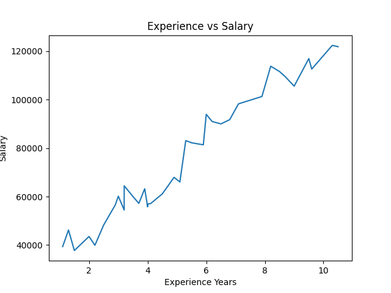

# 💰 Salary Prediction Using Machine Learning

This project implements a machine learning model to predict employee salaries based on years of experience using Linear Regression. It includes data loading, exploration, and visualization to understand the relationship between experience and salary. The dataset is split into training and testing sets to evaluate model performance. The model is assessed using standard evaluation metrics such as Mean Absolute Error (MAE), Mean Absolute Percentage Error (MAPE), and Mean Squared Error (MSE). This project demonstrates fundamental skills in data analysis, machine learning, and model evaluation.

## 🚀 Features
- Data loading and analysis using Pandas
- Data visualization using Matplotlib
- Train/Test split for model evaluation
- Linear Regression model training
- Model evaluation using MAE, MAPE, and MSE

## 🛠️ Technologies Used
- Python
- Pandas
- Matplotlib
- Scikit-learn

## 📊 Data Visualization


## ▶️ How to Run
1. Install dependencies:
```bash
pip install -r requirements.txt
python main.py

📊 Dataset
https://github.com/ybifoundation/Dataset/blob/main/Salary%20Data.csv

📈 Model
Linear Regression is used to predict salary based on years of experience.
